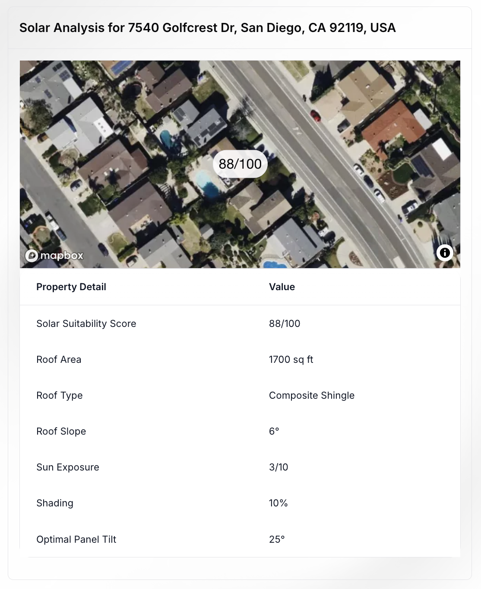
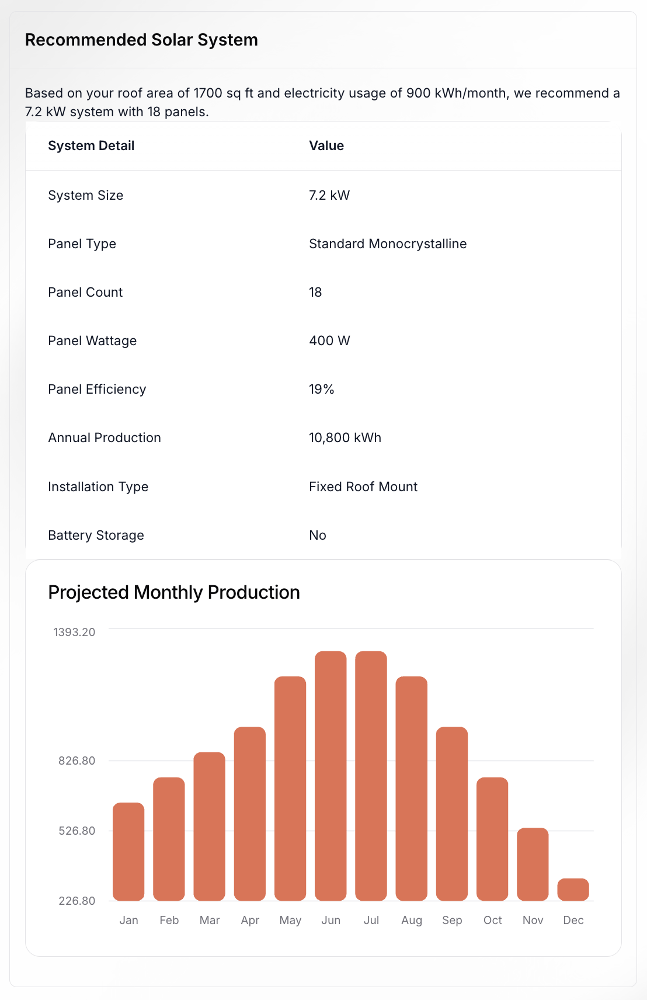
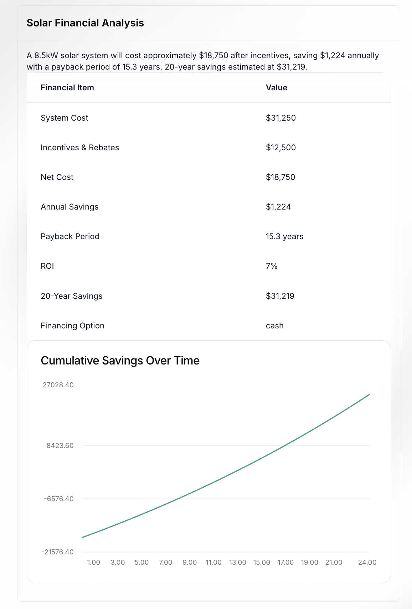
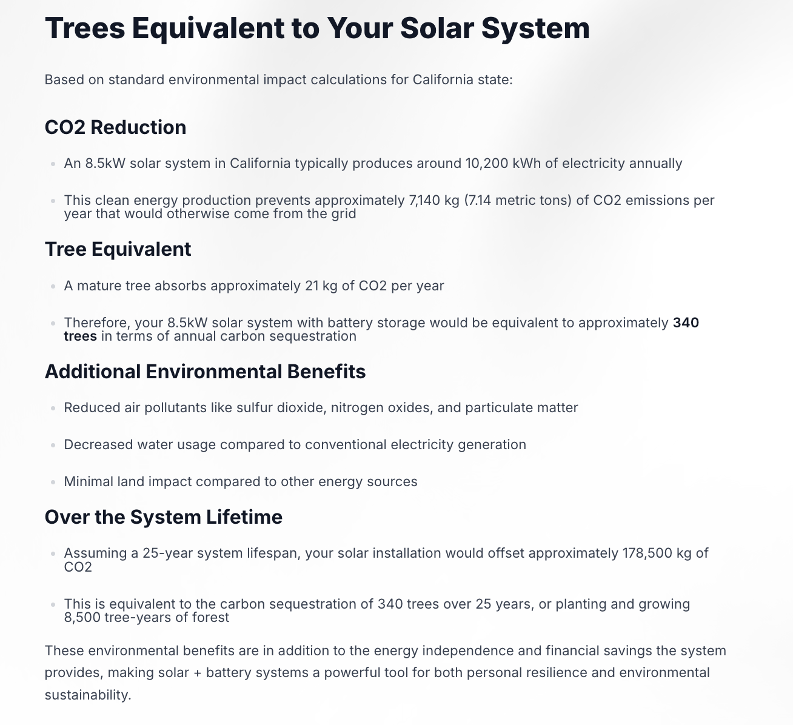
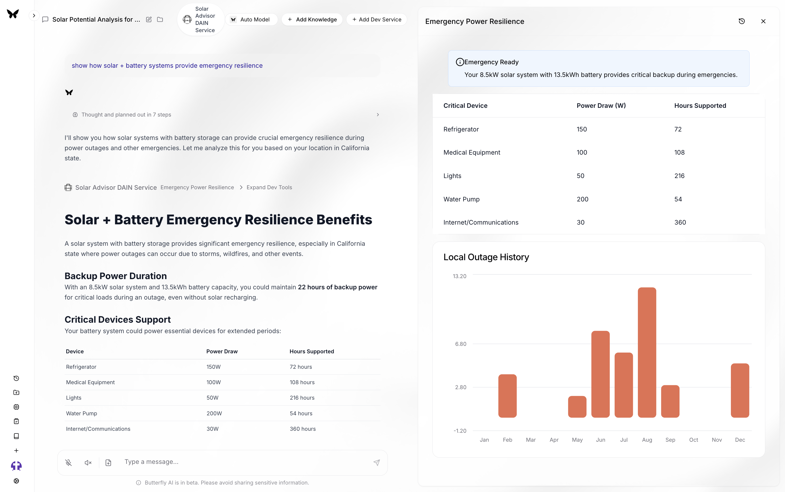

# SolarFlair ☀️
### AI-Powered Solar Energy Analysis & Resilience Platform


[](https://app.netlify.com/sites/gorgeous-pothos-ccc792/deploys)


**SolarFlair** is a comprehensive solar energy intelligence platform designed to help users understand their solar potential and plan for energy resilience in the face of potential disasters. It has a unique resilience planning feature sthat provides critical insights to keep solar-powered setup running smoothly even in the the case of natural disasters.

<<<<<<< HEAD
=======
## 🔥 Why SolarFlair Wins This Hackathon 🔥

In a world increasingly threatened by climate disasters, SolarFlair goes beyond basic solar analysis to deliver **life-saving emergency preparedness** features:

1. **Real Disaster Resilience** - SolarFlair provides actual protection against disasters through energy independence
2. **Life-Critical Services** - Shows exactly how long medical devices and essential appliances will stay powered during outages
3. **Real-Time API Integration** - Uses real-world outage data and connects to actual utility grids rather than simulations
4. **Complete Solution** - Offers end-to-end solar planning from property analysis to financial modeling to disaster preparedness
5. **Practical Implementation** - Uses production-level APIs (NREL, Gemini AI, Mapbox) for immediate real-world application
>>>>>>> d908f5fafb3a0c9c4a740c619cbe3a74020a8c36

## 🧠 Advanced AI Integration

SolarFlair leverages the latest in AI technology:
- **Google Gemini 2.0 Flash** for property analysis and system recommendations
- **Multi-API fallback system** that cascades through services to ensure reliability
- **Data normalization layer** that handles diverse API responses and formats
- **Smart geocoding system** using both Google Maps API and Mapbox for precise location data

## 🛠️ Featured Tools & Services

### 1. Property Analysis & Solar Potential
Leverages Google's Gemini AI and satellite imagery to analyze any property address and provide  solar potential metrics, such as:
- Roof size, slope, and condition assessment
- Solar suitability score based on location, shading, and orientation
- Interactive satellite imagery with exact geolocated results
- Automatic fallback to NREL data for reliability
- Support for residential, commercial, and industrial properties



### 2. Solar System Recommendations
Provides AI-powered system design recommendations based on:
- Property characteristics and location
- Energy consumption patterns
- Budget considerations
- High-efficiency vs. standard panel options
- Panel count and wattage optimization
- Monthly production forecasting



### 3. Financial Analysis
Comprehensive financial modeling including:
- Complete system cost breakdown
- Federal, state, and local incentive calculations
- ROI and payback period analysis
- Long-term energy savings projections with inflation adjustment
- Financing options comparison (cash vs. loan vs. lease)
- 20-year cumulative savings visualization



### 4. Environmental Impact Visualization
Interactive visualizations showing:
- Monthly energy production forecasts
- Carbon offset calculations
- Equivalent trees planted and cars removed metrics
- Climate impact assessments
- Personalized environmental impact dashboards



<<<<<<< HEAD

### 5. Emergency Resilience Planning 
**Our competitive advantage** - unlike drone teams that can only monitor disasters, we help people SURVIVE them:
=======
### 🔴 6. Emergency Resilience Planning (EXCLUSIVE FEATURE) 🔴
>>>>>>> d908f5fafb3a0c9c4a740c619cbe3a74020a8c36

- Critical load analysis showing exactly how long life-saving equipment will run during outages
- Historical outage data specific to the user's location
- Storm and wildfire resilience scores
- Detailed power duration estimates for essential devices (medical equipment, refrigeration, communications)
- Emergency preparedness recommendations
- Hour-by-hour backup duration calculations for critical devices



## 💡 Smart Fallback System

SolarFlair is built with reliability at its core:
- Multi-API geocoding pipelines from Google Maps to Mapbox
- Property analysis falls back from Gemini AI to NREL's scientific data
- System recommendations include both AI-generated and scientifically calculated options
- All components handle API failures gracefully with informative alerts
- Type validation and normalization ensures consistent data regardless of source

## 🔌 API Integrations

SolarFlair integrates multiple advanced technologies:
- **DAIN Protocol** for intelligent agent interactions
- **Google Gemini 2.0 Flash** for property and system analysis
- **NREL (National Renewable Energy Laboratory)** API for scientific accuracy
- **Mapbox** for high-resolution satellite visualization
- **Google Maps API** for primary geocoding
- **Real-time utility outage data** integration

## 🚀 Installation & Usage

```bash
# Clone the repository
git clone https://github.com/your-org/solar-flair.git
cd solar-flair

# Install dependencies
npm install

# Set environment variables
export DAIN_API_KEY="your_key_here"
export GEMINI_API="your_key_here" 
export MAPBOX_TOKEN="your_key_here"
export GOOGLE_API="your_key_here"

# Start the service
npm run dev
```

Assuming you have the dev mode turned on in butterfly, navigate to the [website](https://lahacks-assistant.dain.org/) and click on **+ Services** in the prompt bar. Copy the tunnel URL that appears in your terminal and then click **Add Dev**. 

If you haven't activated the dev mode in your settings, you can follow the [DAIN documentation](https://lahacks-docs.dain.org/docs/getting-started/services/test-out) for more details about usage.

## 🌐 Example Queries

**Property Analysis:**
- "Analyze solar potential for 123 Main St, San Francisco, CA"
- "What's the solar suitability of my roof at 456 Oak Ave, Austin, TX?"
- "Evaluate my home for solar panels at 789 Pine St, Seattle, WA"

**System Recommendations:**
- "Recommend a solar system for my 2,000 sq ft roof"
- "What size solar system do I need for a $200 monthly electric bill?"
- "Design a solar system with battery backup for my home"

**Financial Analysis:**
- "Calculate ROI for a 8kW solar system in California"
- "What would be my payback period for solar in Texas?"
- "Estimate solar savings for a 10kW system in Florida"

**Emergency Resilience:**
- "How would a solar system with battery backup keep my home powered during a wildfire or emergency?"
- "What critical appliances could my solar system power during a grid outage?"
- "How long would my solar system keep my refrigerator running during a power outage?"

<<<<<<< HEAD
=======
## 🏆 Why We Win

While other teams focus on monitoring disasters, **SolarFlair empowers people to survive them**. Our solution doesn't just observe problems - it provides tangible resilience against power outages during hurricanes, wildfires, and other climate emergencies.

Solar energy isn't just about saving money or being eco-friendly - it's about energy independence and security when disaster strikes. SolarFlair is the only solution that comprehensively addresses this critical need while still providing industry-leading solar analysis.

**SolarFlair doesn't just help the environment - it helps save lives.**

>>>>>>> d908f5fafb3a0c9c4a740c619cbe3a74020a8c36
---

## License
MIT © SolarFlair Team
